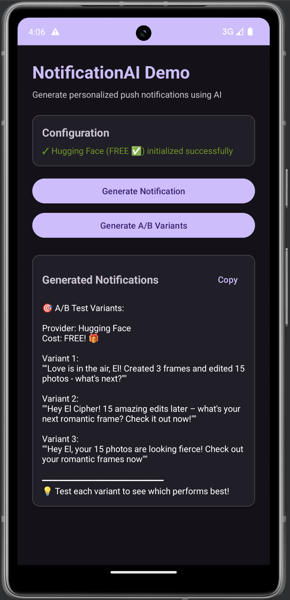

# Personalized AI Notifications

<div align="center">

**🚀 AI-Powered Push Notification Library for Android**

A production-ready Android library that generates personalized, engaging push notifications using multiple AI providers.

**✨ Now with FREE options! Use Google Gemini, Hugging Face, or Ollama - No credit card required!**

</div>

---

## 📸 Screenshots

<div align="center">

### Demo App Preview



*The demo app showing A/B test variants generated using Hugging Face AI*

**Features shown:**
- ✅ Provider initialization status
- 🎯 A/B test variant generation
- 📋 Copy-to-clipboard functionality
- 🎨 Dark theme support
- 💰 Free tier indicators

</div>

---

## 📱 Project Structure

This project contains:

- **`notificationsAI/`** - The main Android library module
- **`app/`** - Demo application showcasing the library

---

## 🎯 What is NotificationAI?

NotificationAI is an Android library that uses artificial intelligence to generate personalized, context-aware push notifications. Instead of sending generic "Come back to our app!" messages, it creates unique, engaging notifications based on:

- User activity and preferences
- App state and features
- Tone and personality
- Language and locale
- Recent crashes or issues

---

## ✨ Key Features

- 🆓 **FREE AI Providers** - Google Gemini, Hugging Face, Ollama (no credit card!)
- 🎯 **Personalized Content** - Context-aware notifications based on user data
- 🎨 **6 Different Tones** - Friendly, motivating, playful, empathetic, humorous, professional
- 🌍 **Multi-Language** - Generate notifications in any language
- 🔄 **A/B Testing** - Generate multiple variants for optimization
- 📊 **Crash-Aware** - Gracefully acknowledge app issues
- ⚡ **Coroutines Support** - Modern async/await patterns
- 🔐 **Secure** - API keys stay in your app

## 🆓 Supported AI Providers

| Provider | Cost | Quality | Speed | Get Started |
|----------|------|---------|-------|-------------|
| **Google Gemini** ⭐ | FREE (60/min) | ⭐⭐⭐⭐⭐ | Fast | [Get Key](https://makersuite.google.com/app/apikey) |
| **Hugging Face** | FREE (unlimited) | ⭐⭐⭐⭐ | Medium | [Get Key](https://huggingface.co/settings/tokens) |
| **Ollama** | FREE (self-hosted) | ⭐⭐⭐⭐ | Fast | [Install](https://ollama.com) |
| OpenAI | $0.001/notification | ⭐⭐⭐⭐⭐ | Fast | [Get Key](https://platform.openai.com/api-keys) |

**💰 Save up to $1,000/month by using free providers!** [Learn more →](FREE_PROVIDERS_GUIDE.md)

---

## 🚀 Quick Start

### 1. Clone the Repository

```bash
git clone https://github.com/yourusername/PersonalizedAINotifications.git
cd PersonalizedAINotifications
```

### 2. Choose an AI Provider & Get API Key

**Option A: Google Gemini (FREE - Recommended)** ⭐
1. Visit [Google AI Studio](https://makersuite.google.com/app/apikey)
2. Click "Get API Key"
3. Copy the key (starts with `AIza...`)

**Option B: Hugging Face (FREE)**
1. Visit [Hugging Face](https://huggingface.co/settings/tokens)
2. Create a token
3. Copy the token (starts with `hf_...`)

**Option C: OpenAI (Paid)**
1. Visit [OpenAI Platform](https://platform.openai.com/api-keys)
2. Create an API key
3. Copy the key (starts with `sk-`)

### 3. Add Your API Key

Open `app/src/main/java/com/compose/personalizedainotifications/MainActivity.kt` and set:

```kotlin
// For Google Gemini (FREE)
val provider = AIProvider.GEMINI
val apiKey = "AIzaSy..." // Your Gemini key

// Or for Hugging Face (FREE)
// val provider = AIProvider.HUGGING_FACE
// val apiKey = "hf_..." // Your HF token
```

### 4. Build and Run

Open the project in Android Studio and run the app on a device or emulator.

---

## 📚 Using the Library

### Installation

Add the library to your project:

```kotlin
// settings.gradle.kts
include(":notificationsAI")

// app/build.gradle.kts
dependencies {
    implementation(project(":notificationsAI"))
}
```

### Basic Usage

```kotlin
import com.ihsib.notificationsAI.NotificationAI
import com.ihsib.notificationsAI.models.NotificationTone
import com.ihsib.notificationsAI.models.NotificationResult

// 1. Initialize
NotificationAI.init(
    openAiApiKey = "sk-...",
    userSession = mapOf(
        "name" to "Alex",
        "level" to "5"
    )
)

// 2. Generate notification
NotificationAI.generateNotification(
    appPackageName = "com.example.app",
    tone = NotificationTone.PLAYFUL
) { result ->
    when (result) {
        is NotificationResult.Success -> {
            println(result.notification)
            // "Hey Alex! Your latest score is waiting!"
        }
        is NotificationResult.Error -> {
            println("Error: ${result.message}")
        }
    }
}
```

### With Coroutines

```kotlin
lifecycleScope.launch {
    val result = NotificationAI.generateNotificationAsync(
        appPackageName = packageName,
        tone = NotificationTone.MOTIVATING
    )
    
    if (result is NotificationResult.Success) {
        showNotification(result.notification)
    }
}
```

---

## 🎨 Examples

### Switch Between Providers

```kotlin
// Use Google Gemini (FREE)
NotificationAI.init(
    provider = AIProvider.GEMINI,
    apiKey = "AIzaSy..."
)

// Or Hugging Face (FREE)
NotificationAI.init(
    provider = AIProvider.HUGGING_FACE,
    apiKey = "hf_..."
)

// Or OpenAI (Paid)
NotificationAI.init(
    provider = AIProvider.OPENAI,
    apiKey = "sk-..."
)

// Or Ollama (Self-hosted, FREE)
NotificationAI.init(
    provider = AIProvider.OLLAMA,
    serverUrl = "http://your-server:11434"
)
```

### Different Tones

```kotlin
// Friendly
NotificationAI.generateNotification(tone = NotificationTone.FRIENDLY)
// "Hey El Cipher! Ready for more?"

// Motivating
NotificationAI.generateNotification(tone = NotificationTone.MOTIVATING)
// "You're doing amazing! Keep it up!"

// Playful
NotificationAI.generateNotification(tone = NotificationTone.PLAYFUL)
// "El Cipher! Let's create something beautiful! 🎉"
```

### A/B Testing

```kotlin
NotificationAI.generateVariants(
    appPackageName = packageName,
    count = 3
) { results ->
    results.forEach { result ->
        if (result is NotificationResult.Success) {
            println("Variant: ${result.notification}")
        }
    }
}
```

### Multi-Language

```kotlin
NotificationAI.generateNotification(
    appPackageName = packageName,
    locale = "es" // Spanish
)
// "¡Hola! Te extrañamos. Vuelve a la app."
```

---

## 📖 Documentation

| Document | Description |
|----------|-------------|
| [FREE Providers Guide](FREE_PROVIDERS_GUIDE.md) | **Start here!** Setup Google Gemini, Hugging Face, Ollama |
| [Quick Start](QUICKSTART.md) | Get up and running in 5 minutes |
| [Library Documentation](notificationsAI/README.md) | Complete API reference and advanced usage |
| [How It Works](HOW_IT_WORKS.md) | Architecture and technical details |
| [Project Summary](PROJECT_SUMMARY.md) | Complete project overview |

**New to the library?** Start with the [FREE Providers Guide](FREE_PROVIDERS_GUIDE.md)!

---

## 🏗️ Architecture

```
PersonalizedAINotifications/
├── notificationsAI/                 # Library module
│   ├── src/main/java/
│   │   └── com/ihsib/notificationsAI/
│   │       ├── NotificationAI.kt    # Main API
│   │       ├── PromptBuilder.kt     # Prompt generation
│   │       ├── api/
│   │       │   └── OpenAIClient.kt  # OpenAI API client
│   │       └── models/
│   │           ├── NotificationConfig.kt
│   │           ├── NotificationResult.kt
│   │           └── OpenAIModels.kt
│   └── build.gradle.kts
├── app/                             # Demo app
│   ├── src/main/
│   │   ├── java/.../MainActivity.kt # Example usage
│   │   └── res/layout/activity_main.xml
│   └── build.gradle.kts
└── README.md
```

---

## 🔐 Security

**⚠️ Important Security Notes:**

1. **Never commit API keys** to version control
2. **Use environment variables** for production builds
3. **Implement rate limiting** to prevent abuse
4. **Use ProGuard/R8** to obfuscate the library in production

### Secure API Key Management

```kotlin
// build.gradle.kts
android {
    buildTypes {
        release {
            buildConfigField(
                "String",
                "OPENAI_API_KEY",
                "\"${System.getenv("OPENAI_API_KEY")}\""
            )
        }
    }
}

// In your code
NotificationAI.init(
    openAiApiKey = BuildConfig.OPENAI_API_KEY
)
```

---

## 💰 Cost Considerations

NotificationAI uses OpenAI's paid API:

- **gpt-3.5-turbo**: ~$0.0015 per 1K tokens
- **Average cost per notification**: ~$0.001

**Monthly cost estimates:**
- 1,000 notifications: ~$1
- 10,000 notifications: ~$10
- 100,000 notifications: ~$100

**Cost optimization tips:**
1. Cache similar notifications
2. Use batching during off-peak hours
3. Implement rate limiting
4. Consider using a cheaper model for simple cases

---

## 🧪 Testing

### Run Unit Tests

```bash
./gradlew test
```

### Run Instrumentation Tests

```bash
./gradlew connectedAndroidTest
```

---

## 🛠️ Requirements

- **Android Studio**: Arctic Fox or newer
- **Min SDK**: 24 (Android 7.0)
- **Target SDK**: 34 (Android 14)
- **Kotlin**: 2.0.21
- **OpenAI API Key**: Required

---

## 📦 Dependencies

- **OkHttp**: HTTP client for API requests
- **Gson**: JSON serialization/deserialization
- **Kotlin Coroutines**: Async operations
- **AndroidX**: Core Android libraries

---

## 🤝 Contributing

Contributions are welcome! Here's how:

1. Fork the repository
2. Create a feature branch (`git checkout -b feature/amazing-feature`)
3. Commit your changes (`git commit -m 'Add amazing feature'`)
4. Push to the branch (`git push origin feature/amazing-feature`)
5. Open a Pull Request

---

## 📝 License

This project is licensed under the MIT License - see the [LICENSE](LICENSE) file for details.

---

## 🆘 Support

Need help? Here's where to go:

- **📚 Documentation**: [notificationsAI/README.md](notificationsAI/README.md)
- **🐛 Issues**: [GitHub Issues](https://github.com/yourusername/PersonalizedAINotifications/issues)
- **💬 Discussions**: [GitHub Discussions](https://github.com/yourusername/PersonalizedAINotifications/discussions)
- **📧 Email**: support@yourcompany.com

---

## 🎯 Roadmap

- [ ] Support for more AI models (Claude, Gemini)
- [ ] Built-in analytics and A/B testing
- [ ] Rate limiting and caching utilities
- [ ] Template library for common use cases
- [ ] WordPress plugin integration
- [ ] Firebase Cloud Messaging integration
- [ ] Notification scheduling

---

## 🙏 Acknowledgments

- [OpenAI](https://openai.com) for the GPT API
- [Square](https://square.github.io/okhttp/) for OkHttp
- [Google](https://github.com/google/gson) for Gson

---

## 📊 Stats

- **Lines of Code**: ~1,500
- **API Methods**: 8
- **Supported Languages**: All (via OpenAI)
- **Notification Tones**: 6

---

<div align="center">

**Made with ❤️ for developers who care about user engagement**

[⭐ Star this repo](https://github.com/yourusername/PersonalizedAINotifications) if you find it useful!

</div>

